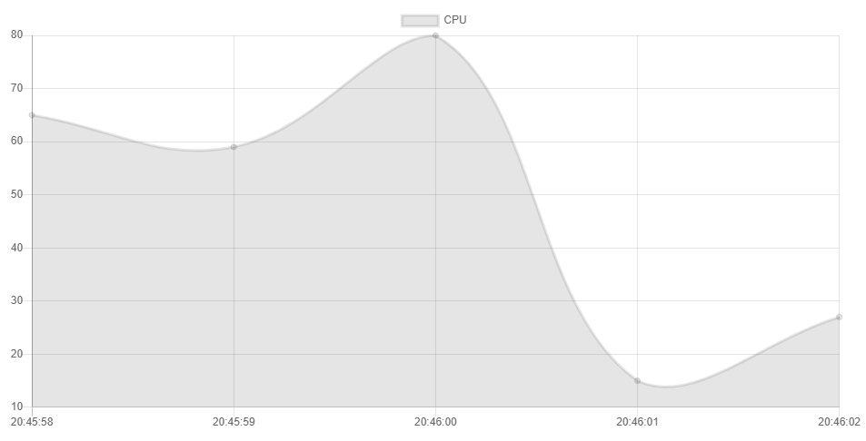

# Chapter.1

[Korean Here!](https://blog.naver.com/bi0416/222250170697)

## 0. What is Chart.js?

Chart.js is an open source project that draws charts and graphs with Javascript.

You can draw charts easily if you have a little of HTML and Javascript knowledge.

1. Getting Started

Chart.js can be downloaded for the Chart.js Github or used via CDN.

I used this CDN.

``` html
<script src="https://cdn.jsdelivr.net/npm/chart.js@2.9.4/dist/Chart.min.js" type="text/javascript"></script>
```
Chart is drawn on top of canvas. Prepare a canvas.


``` html
<canvas id="chart" width="800" height="400"></canvas>
```

| Options |        Descriptions        |
|:-------:|:--------------------------:|
|   id    | You should specify any id. |
|  width  |       canvas' width.       |
| height  |      canvas' height.       |


I will explain later how to set width and height to 100%.

In addition, I will create a seperate Javascript file and write code in the file.

This is the base code.

``` html
<!DOCTYPE html>
<html lang="ko">
<head>
    <meta charset="UTF-8">
    <title>Chapter.1</title>
</head>
<body>
    <canvas id="chart" width="800" height="400"></canvas>
    <script src="https://cdn.jsdelivr.net/npm/chart.js@2.9.4/dist/Chart.min.js" type="text/javascript"></script>
    <script src="./index.js" type="text/javascript"></script>
</body>
</html>
```

## 2. Draw a line graph

From now on, it will proceed with index.js, a separate JavaScript file.

``` javascript
var ctx = document.getElementById('chart').getContext('2d');
var myChart = new Chart(ctx, {
    type: 'line',
    data: {
        labels: ['20:45:58', '20:45:59', '20:46:00', '20:46:01', '20:46:02'],
        datasets: [{
            label: 'CPU',
            data: [65, 59, 80, 15, 27],
        }]
    }
});
```

| Options |                                  Descriptions                                   |
|:-------:|:-------------------------------------------------------------------------------:|
|  type   | Chart's type. [Plz see this page.](https://www.chartjs.org/docs/latest/charts/) |
| labels  |                                The x-axis item.                                 |
|  label  |                              The dataset's title.                               |
|  data   |                                  Graph's data.                                  |



I drew a CPU graph. I will improve gradually.
