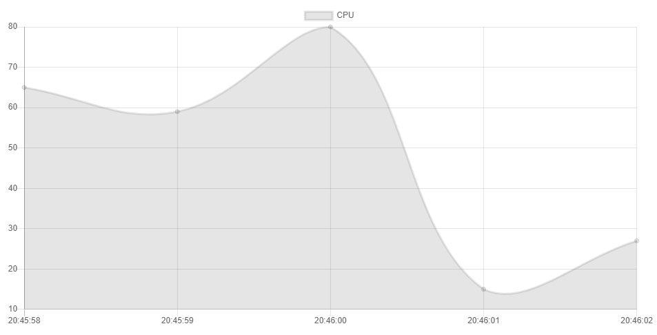
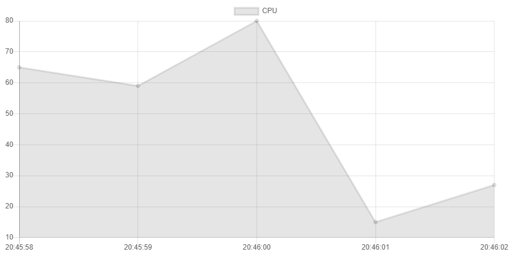
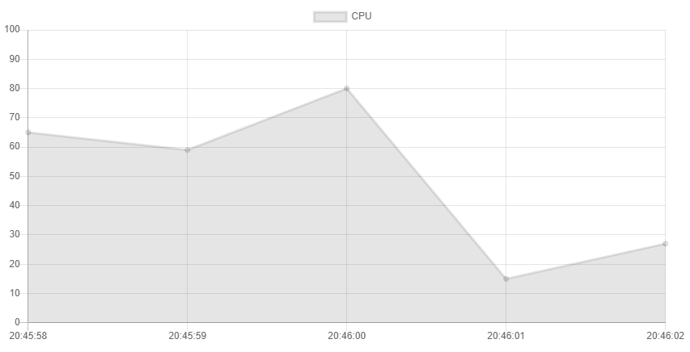
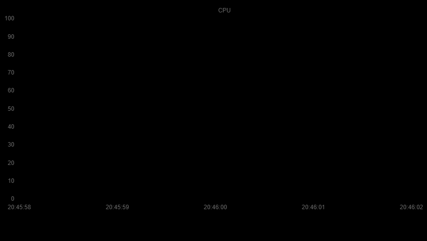
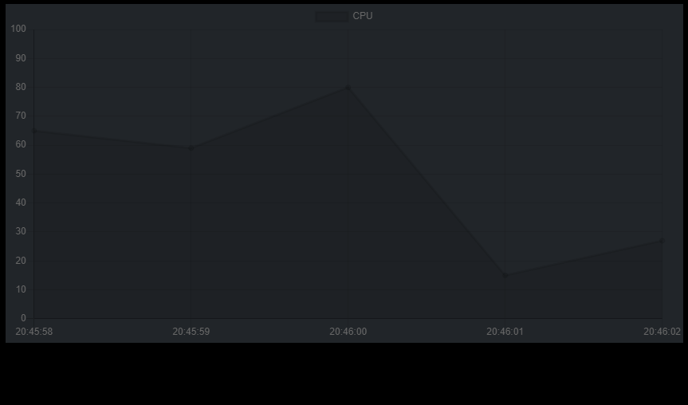
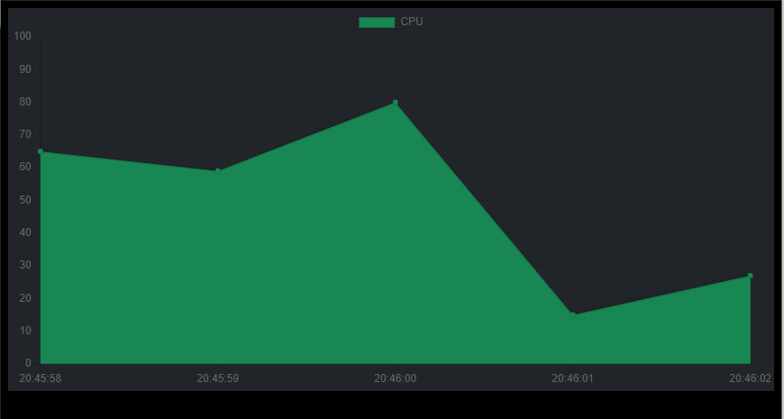
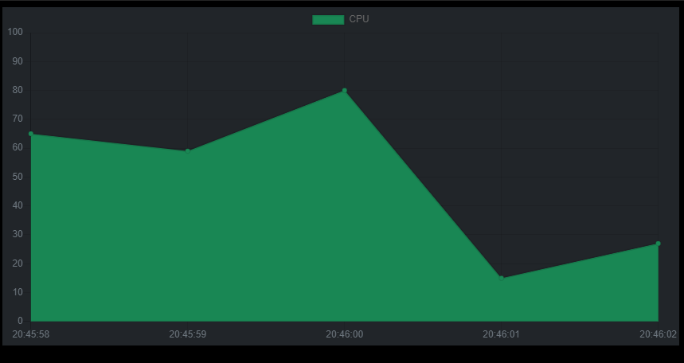
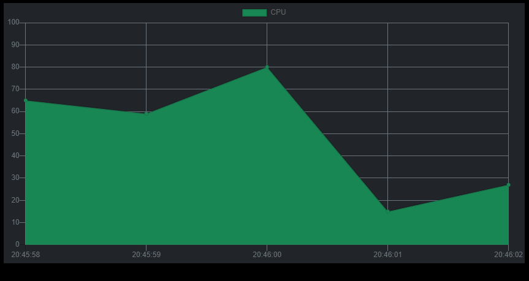

# Chapter.2

[Korean Here!](https://blog.naver.com/bi0416/222253406011)

## 1. Line Graph Straighten



This is a chart which includes line graph. But the lines are curved.

This type of graph is unsuitable for use in resource monitors.

I'm going to make this graph straight.

```
lineTension: 0
```

Plz apply this option in Chart.js.

``` javascript
var ctx = document.getElementById('chart').getContext('2d');
var myChart = new Chart(ctx, {
    type: 'line',
    data: {
        labels: ['20:45:58', '20:45:59', '20:46:00', '20:46:01', '20:46:02'],
        datasets: [{
            label: 'CPU',
            data: [65, 59, 80, 15, 27],
            lineTension: 0
        }]
    }
});
```

Then you can see this type of graph.



## 2. Set Max and Min

CPU Utilization has values ranging from 0% to 100%.

However, the current graph has the y-axis maximum set to the maximum value of the data.

``` javascript
data: {
    labels: ['20:45:58', '20:45:59', '20:46:00', '20:46:01', '20:46:02'],
    datasets: [{
        label: 'CPU',
        data: [65, 59, 80, 15, 27],
        lineTension: 0,
    }]
},
options: {
    scales: {
        yAxes: [{
            ticks: {
                min: 0,
                max: 100
            }
        }]
    }
}
```

Set `max` and `min` options. They are options for the entire canvas.



You can see the graph which is shown in units of 10 from 0 to 100.

## 3. Set Graph Color

I'm going to develop our service's monitoring system to dark mode.

So I should customize this chart.

``` html
<style>
    body {
        background-color: #000000;
    }
</style>
```

Put this style code into `<head>` in HTML. You can use CSS stylesheet.



You may can see label, but cannot see graph.

We should increase readability by modifying the chart.

### 3-1. Modify Canvas Background Color

``` css
canvas {
    background-color: #212529;
}
```

Modify canvas background color to bootstrap's `bg-dark`.

Also you can apply bootstrap and set class to `bg-dark`.



### 3-2. Modify Graph Color

``` javascript
data: {
    labels: ['20:45:58', '20:45:59', '20:46:00', '20:46:01', '20:46:02'],
    datasets: [{
        label: 'CPU',
        data: [65, 59, 80, 15, 27],
        lineTension: 0,
        backgroundColor: '#198754'
    }]
},
options: {
    scales: {
        yAxes: [{
            ticks: {
                min: 0,
                max: 100
            }
        }]
    }
}
```

Plz set background color into datasets. You can use `rgb(..., ..., ...)`.



### 3-3. Modify Label Color

``` javascript
data: {
    labels: ['20:45:58', '20:45:59', '20:46:00', '20:46:01', '20:46:02'],
    datasets: [{
        label: 'CPU',
        data: [65, 59, 80, 15, 27],
        lineTension: 0,
        backgroundColor: '#198754'
    }]
},
options: {
    scales: {
        xAxes: [{
            ticks: {
                fontColor: '#6c757d'
            }
        }],
        yAxes: [{
            ticks: {
                min: 0,
                max: 100,
                fontColor: '#6c757d'
            }
        }]
    }
}
```

Use `fontColor` into Axis options.



It is brighter than the existing color, making it more readable.

### 3-4. Modify Grid Color

``` javascript
data: {
    labels: ['20:45:58', '20:45:59', '20:46:00', '20:46:01', '20:46:02'],
    datasets: [{
        label: 'CPU',
        data: [65, 59, 80, 15, 27],
        lineTension: 0,
        backgroundColor: '#198754'
    }]
},
options: {
    scales: {
        xAxes: [{
            ticks: {
                fontColor: '#6c757d'
            },
            gridLines: {
                color: '#6c757d'
            }
        }],
        yAxes: [{
            ticks: {
                min: 0,
                max: 100,
                fontColor: '#6c757d'
            },
            gridLines: {
                color: '#6c757d'
            }
        }]
    }
}
```

Use `gridLines` into Axis options.

